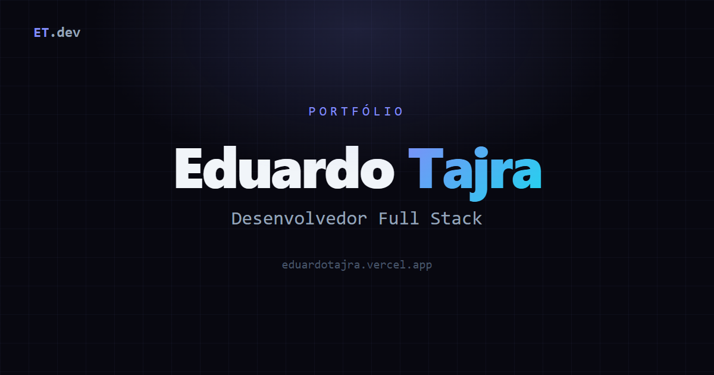

# Portfólio

Meu site pessoal com projetos, trajetória e contatos.

**No ar em: [eduardotajra.vercel.app](https://eduardotajra.vercel.app)**



## Stack

- React + Vite
- Tailwind CSS
- Framer Motion para as animações

## Rodando local

```bash
npm install
npm run dev
```

## Estrutura

- `src/components` tem as seções do site (Hero, Projects, About, Experience, Contact)
- `src/data/projects.js` é a lista de projetos que aparece nos cards
- `public/screenshots` guarda os previews dos projetos
